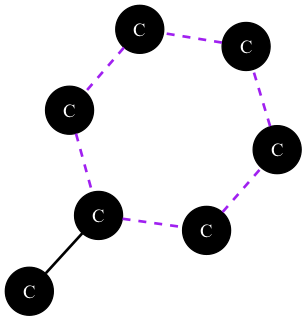
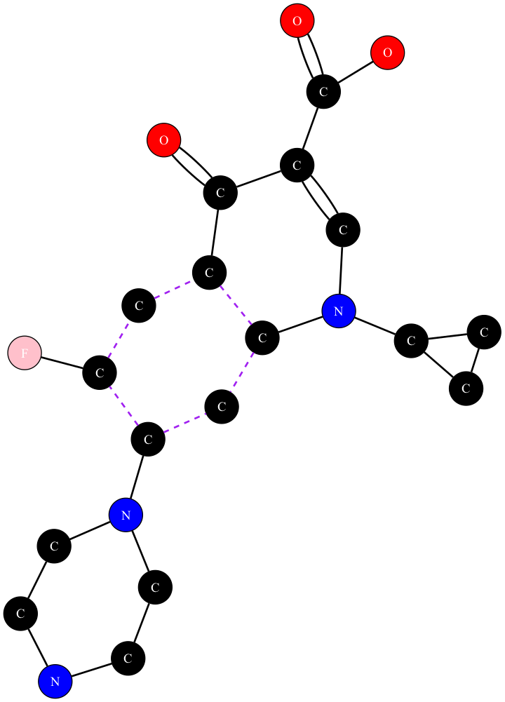
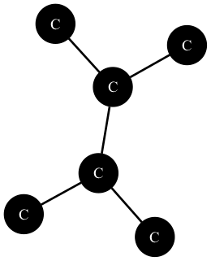

# molecule

This crate is a tool to parse molecule structures from a SMILES string, and to perform various operations on them.

<div align="center">
  <h3>
    <a target="_blank" href="https://adam-mcdaniel.github.io/molecule">Documentation</a>
    <span> | </span>
    <a target="_blank" href="http://adam-mcdaniel.github.io">My Website</a>
  </h3>

  <sub>Written in Rust🦀💖</sub>
</div>

<div align="center">
    
    
    
</div>


## Table of Contents

- [Features](#features)
- [Definitions](#definitions)
- [Graph Algorithms](#graph-algorithms)
    - [Graph Representation](#graph-representation)
    - [Longest Chain Extraction (Acyclic Naming)](#longest-chain-extraction-acyclic-naming)
    - [Cycle Detection (Cyclic Naming)](#cycle-detection-cyclic-naming)
    - [Canonical Numbering via Lexicographic Minimization](#canonical-numbering-via-lexicographic-minimization)
    - [Handling Unsaturation and Special Bonds](#handling-unsaturation-and-special-bonds)
    - [Substituent Identification and Naming](#substituent-identification-and-naming)
    - [Aromatic Ring Handling](#aromatic-ring-handling)
    - [Summary of Techniques](#summary-of-techniques)
- [Usage](#usage)
- [License](#license)
- [About the Author](#about-the-author)

## Features

- Parse a SMILES string into a molecule structure
- Generate the IUPAC name of a molecule from its structure
- Visualize a molecule structure
- Manipulate a molecule structure (add/remove atoms, bonds, etc.)

## Definitions

For the sake of clarity for those computer scientists (like me) who may not be familiar with organic chemistry, here are some definitions:

|Term|Definition|
|---|---|
|**Saturation**|A molecule is *saturated* if every bond between carbon atoms is a single edge (think of a graph with only one edge between nodes). In our naming, if no edge in the parent chain is marked as double or triple, we treat it as an "alkane" (e.g., methane, ethane).|
|**Desaturation (Unsaturation)**| *Desaturation* means the molecule contains at least one double or triple bond (edges with extra "weight"). These extra bonds change the name’s suffix (e.g., "ene" for a double bond, "yne" for a triple bond). If there are multiple unsaturations, we adjust the base name (e.g., "but" becomes "buta" to form "butadiene").|
|**Substituents**|Substituents are branches off the main chain. In graph terms, they are nodes attached to the main path (parent chain) that are not part of that path. They can be simple alkyl groups (like methyl, ethyl) or functional groups (like hydroxyl or amino).|
|**Aromaticity**|Aromaticity is a special property of certain cyclic (closed-loop) graphs where electrons are delocalized, meaning that the electrons are shared across the entire ring: they move freely to any atom within the cycle. In our model, aromatic atoms are flagged (e.g., as CAromatic). A ring where every node is aromatic gets a special name (e.g., benzene instead of cyclohexane).|
|**Canonical Numbering**|Canonical numbering is like assigning the "best" labels to nodes so that the configuration is unique and minimal. We choose the numbering (or ordering) that gives the smallest (lexicographically minimal) set of locants for substituents, similar to finding a canonical graph labeling. In short, we want to assign numbers to atoms in a way that minimizes the total value of the numbers.|
|**Parent Chain**|The parent chain is the longest simple path of carbon atoms in the molecule. In graph terms, it’s the longest path (backbone) that we can find, and it forms the basis for the molecule’s name.|

## Graph Algorithms

### Graph Representation

We represent molecules as an undirected graph where nodes represent atoms (with types like carbon, oxygen, etc.) and edges represent bonds (single, double, triple, aromatic). We use a petgraph `UnGraph` data structure to store the graph information. This setup is similar to the modules used in cheminformatics, and allows for easy manipulation of the molecule structure.

### Longest Chain Extraction (Acyclic Naming)

First, we need to determine the "parent chain" of carbon atoms (the longest continuous path) in the molecule. In IUPAC nomenclature, the longest carbon chain forms the backbone of the compounds name.
To do this, we perform a depth-first search on the molecule graph, starting from each carbon atom. We then select the longest path found as the parent chain.

The problem of finding the longest simple path is NP-hard in general, but the IUPAC nomenclature constraints make the problem tractable, as backtracking is not allowed. So, it doesn't exhibit the same combinatorial explosion as the general problem.

### Cycle Detection (Cyclic Naming)

To name cyclic compounds, we need to determine if the molecule contains rings composed entirely of carbon (or aromatic carbon). For cyclic compounds, a different naming scheme (e.g. "cyclohexane" or "benzene") is applied. We also perform a depth-first search to detect cycles in the molecule graph, noting the back edges at each step and checking for repeats that would indicate a cycle.

A helper function (`is_carbon`) is used so that both aliphatic and aromatic carbons are considered. This is crucial for correctly identifying aromatic rings such as benzene.

This method is akin to standard cycle detection algorithms for undirected graphs, a common topic in graph theory and algorithm courses. While Tarjan’s algorithm is used for strongly connected components in directed graphs, here a simple DFS with backtracking suffices for our undirected case.

### Canonical Numbering via Lexicographic Minimization

For acyclic compounds, once the longest chain is found, substituents (branches) are identified and numbered. The algorithm computes two possible numberings (original and reversed) and chooses the one that minimizes the set of substituent locants lexicographically. This follows IUPAC rules to give the lowest set of numbers to substituents.

For cyclic compounds, especially when multiple rotations or directions (clockwise vs. anticlockwise) are possible, the algorithm generates all rotations (and their reversals) of the ring. It then selects the numbering that yields the lowest lexicographic order of substituent locants.

Because rings in organic molecules are usually small (e.g., 5–7 members), enumerating all rotations is computationally feasible.

This approach is analogous to canonical labeling in graph isomorphism problems. In fact, our method is conceptually similar to the NAUTY algorithm, where the goal is to assign a unique "canonical form" to a graph. Here, we choose the numbering that yields the lexicographically smallest sequence of locants.

For cyclic compounds, the inherent symmetry means there are multiple valid cyclic orderings. We generate all rotations and both orientations (clockwise and anticlockwise) of the ring. For each candidate, substituent locants are computed, and the configuration that minimizes the sorted list of locants is chosen.

### Handling Unsaturation and Special Bonds

We inspect each consecutive pair of nodes in the parent chain for the presence of double or triple bonds. Unsaturation is recorded by counting the number of such bonds and storing their positions (locants).

The degree of unsaturation (DU) is calculated with the following formula:

$$DU = \frac{2C + 2 - H + N - X}{2}$$

When multiple unsaturations occur (e.g., in 1,3-butadiene), we insert an "a" into the base name (e.g., converting "but" to "buta") so that the final suffix forms correctly (i.e., "butadiene" rather than "butdiene"). This is a neat integration of chemical naming heuristics with our graph-based analysis.

Examples
1. C₆H₁₄ (Hexane)
$$DU = \frac{2(6) + 2 - 14}{2} = \frac{14 - 14}{2} = 0$$
So, it's fully saturated (no unsaturation).

2. C₆H₁₂ (Cyclohexane or 1-Hexene)
$$DU = \frac{2(6) + 2 - 12}{2} = \frac{14 - 12}{2} = 1$$
So, it has one ring or one double bond.

3. C₆H₆ (Benzene)
$$DU = \frac{2(6) + 2 - 6}{2} = \frac{14 - 6}{2} = 4$$
So, it's an aromatic system (benzene ring).

The algorithm also examines the bond type connecting substituents. For example, if a nitrogen is attached via a triple bond, it is named "cyano" (indicating a nitrile group) rather than "amino." This local inspection of edge attributes showcases how our graph algorithms combine structural analysis with domain-specific rules.

### Substituent Identification and Naming

For each atom in the parent chain (or ring), the algorithm inspects neighboring atoms not on the main chain. It then classifies these as substituents (e.g., "methyl", "ethyl", "hydroxy", "amino") based on the type and connectivity.

For carbon substituents, a secondary DFS (or iterative search using a stack) is used to count the number of connected carbon atoms in the branch. This determines if the substituent should be named as a methyl (1 carbon), ethyl (2 carbons), etc.

After identifying substituents, they are grouped by type and sorted by their positions on the parent chain. When multiple identical substituents occur, we use multiplicative prefixes (di-, tri-, etc.) as per IUPAC rules. The final substituent strings are then concatenated (using commas where necessary) and prepended to the base name.

### Aromatic Ring Handling

- Aromatic vs. Aliphatic: The algorithm differentiates between aromatic rings (where every atom is marked as aromatic, e.g., Element::CAromatic) and non-aromatic rings.
    - For a six-membered aromatic ring with no substituents, it returns the conventional name "benzene".
    - If substituents are present on an aromatic ring (e.g. methylcyclohexane vs. methylbenzene), the algorithms applies the same numbering minimization technique to determine the correct correct locants and then concatenates the substituent prefix with "benzene".

### Summary of Techniques
1. Graph Traversals (DFS):
We use DFS for both longest path extraction (to determine the parent chain) and for cycle detection (to identify rings).

2. Brute-Force Enumeration:
For cyclic numbering, we enumerate all rotations and reflections (elements of the dihedral group) to achieve canonical numbering.

3. Lexicographic Minimization:
Both for acyclic and cyclic cases, the best numbering is chosen by comparing lexicographically ordered locant sequences. This mirrors techniques in canonical labeling and combinatorial optimization.

4. Integration of Domain-Specific Heuristics:
Chemical nomenclature rules (handling unsaturation, aromaticity, and substituent naming) are integrated with classical graph algorithms. This interdisciplinary approach demonstrates how rigorous algorithmic methods can be applied to solve complex problems in cheminformatics.

## Usage

To begin using this crate, add the following to your `Cargo.toml` file:

```toml
[dependencies]
molecule = { git = "https://github.com/adam-mcdaniel/molecule" }
```

Then, you can use the crate in your code like so:

```rust
use molecule::{parse_smiles, visualize_graph, iupac_name};

fn main() {
    let smiles = "CCO"; // Ethanol
    
    let molecule = parse_smiles(smiles).expect("Failed to parse SMILES");
    
    assert_eq!(molecule.node_count(), 3); // 2 Carbons, 1 Oxygen
    
    visualize_graph(&molecule, "ethanol.dot", Some("ethanol.png")).expect("Failed to visualize graph");

    println!("IUPAC name: {}", iupac_name(&molecule));
}
```

## License

This project is licensed under the MIT License - see the [LICENSE](LICENSE) file for details.

## About the Author

Hello, [I'm Adam McDaniel](https://adam-mcdaniel.github.io/), a software engineer and computer science PhD student at the University of Tennessee Knoxville. I'm passionate about programming languages, compilers, and formal methods. I'm a huge fan of Rust and functional programming, and I love building tools that help people write better software.

Here's some interesting links for some of my other projects:

### My Interesting Links

|Website|
|---|
|[My programming language🧑‍💻](https://adam-mcdaniel.net/sage-website)|
|[My shell🐚](https://adam-mcdaniel.net/dune-website/)|
|[My YouTube📽️ (compilers and music)](https://youtu.be/QdnxjYj1pS0?si=pwvegcPkEvqmqF8b)|
|[My blog📝](https://adam-mcdaniel.net/blog)|
|[My logic language🧮](https://github.com/adam-mcdaniel/reckon)|